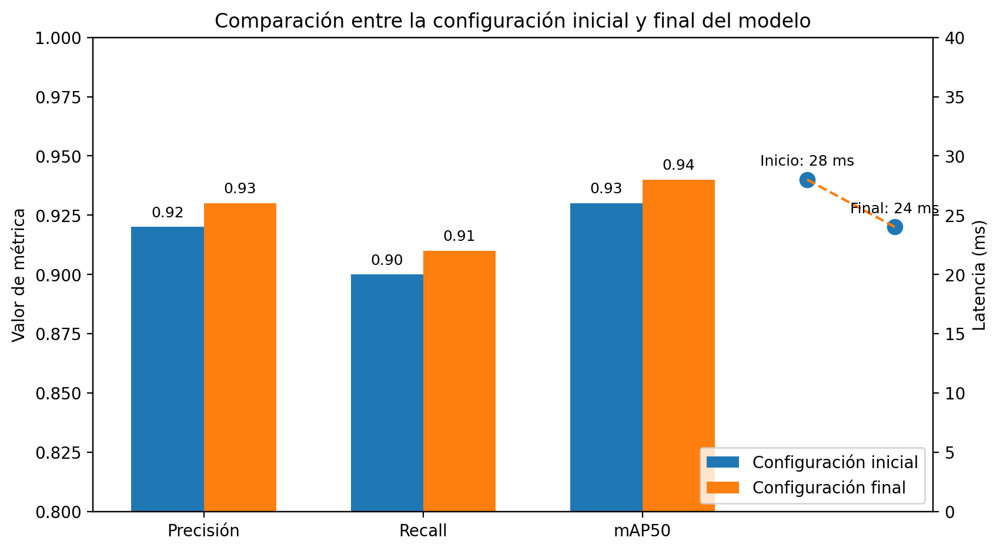
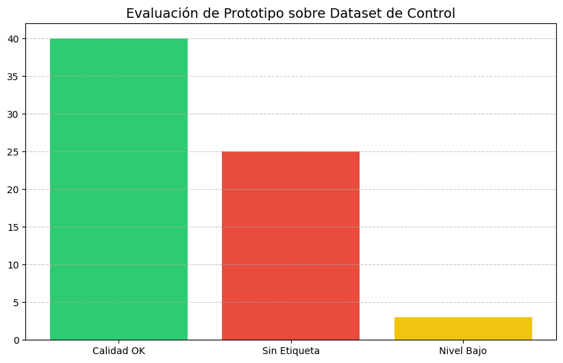

# Sistema de Auditoría de Calidad Industrial - ILEPSA 🏭🤖

Este proyecto presenta un sistema de visión artificial híbrido para el control de procesos y aseguramiento de la calidad.

## 📈 Rendimiento y Métricas de Entrenamiento
Optimización del modelo final para operación en tiempo real.

| Comparativa de Rendimiento | Métricas de Entrenamiento |
|---|---|
|  |  |

## 🧪 Validación con Dataset de Control (55 Imágenes)
Resultados obtenidos en la evaluación del prototipo con datos reales de planta.

- **Tasa de Calidad Detectada:** 58.82%
- **Fallas:** 25 etiquetas faltantes y 3 niveles de llenado incorrectos.

## 📋 Documentación del Proceso
Análisis de fases, flujos y comparativas económicas del proyecto.

| Flujo de Detecciones | Fases del Proyecto | Comparación Económica |
|---|---|---|
|  |  |  |

## 🛠️ Tecnologías
- **IA:** YOLOv8 Nano
- **Lógica:** Híbrida (IA + OpenCV)
- **Dataset:** Roboflow
